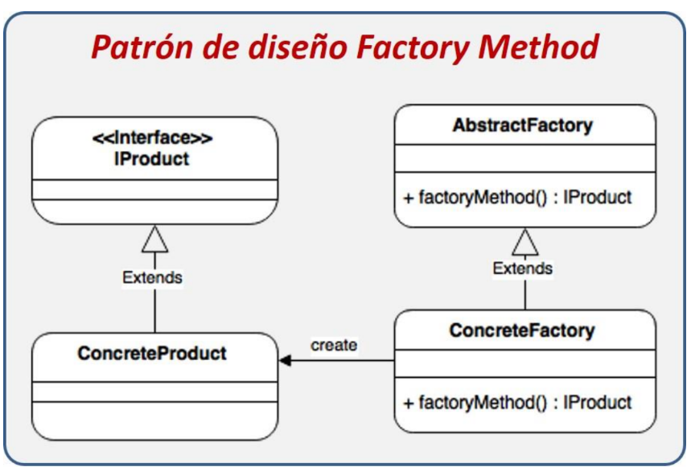
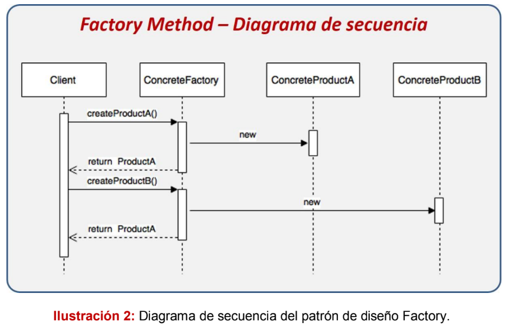
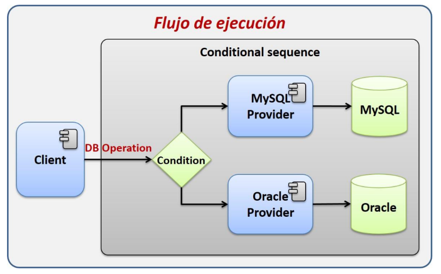
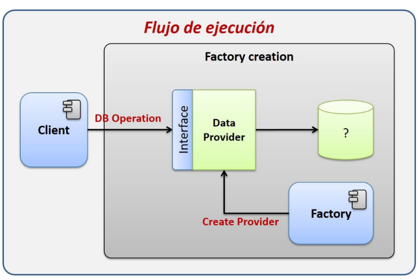
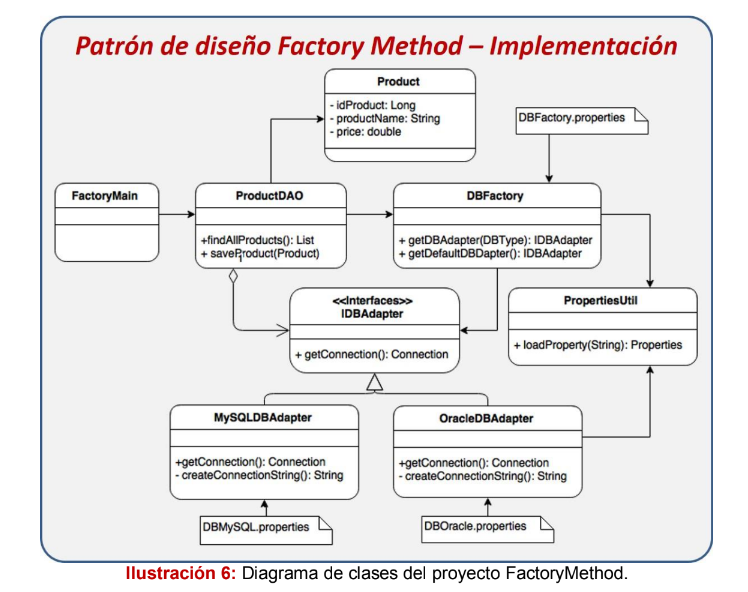

## Factory Method
Permite la creación de objetos de un subtipo determinado a través
de una clase Factory. Esto es especialmente útil cuando no sabemos, en tiempo
de diseño, el subtipo que vamos a utilizar o cuando queremos delegar la lógica
de creación de los objetos a una clase Factory. Utilizando este patrón podemos
crear instancias dinámicamente mediante la configuración, estableciendo cual
será la implementación a utilizar en un archivo.

## Ejemplo práctico.
Se emplea el patrón realizando una aplicación donde aplicamos el patrón, a la hora de realizar multiples opciones de conexiones a bases de datos.
A la hora de gestionar los diferentes motores de BD disponibles, se emplea una interface 

Ejemplo de flujo sin aplicar el Patrón.

Ejemplo de flujo aplicando el Patrón Factory.

## Scripts para la creación de tablas
## -- Script para Oracle
CREATE TABLE productos (idProductos NUMERIC(10,0) NOT NULL, productName VARCHAR(100) NOT NULL, productPrice DECIMAL(10,2) NOT NULL);

## -- Script para MySQL
CREATE TABLE `productos` (`idProductos` INT NOT NULL, `productName` VARCHAR(100) NOT NULL, `productPrice` DECIMAL NOT NULL DEFAULT 0.0, PRIMARY KEY (`idProductos`), UNIQUE INDEX `productName_UNIQUE` (`productName` ASC)) ENGINE = InnoDB COMMENT = 'Tabla de productos';

